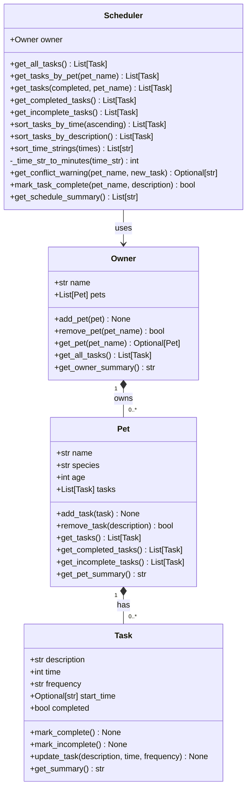

# PawPal+ (Module 2 Project)

You are building **PawPal+**, a Streamlit app that helps a pet owner plan care tasks for their pet.

## 📸 Demo

<a href="C:\Users\conte\OneDrive\Desktop\Codepathfiles\Sreenshoots\Demo1.png" target="_blank"></a>

## Scenario

A busy pet owner needs help staying consistent with pet care. They want an assistant that can:

- Track pet care tasks (walks, feeding, meds, enrichment, grooming, etc.)
- Consider constraints (time available, priority, owner preferences)
- Produce a daily plan and explain why it chose that plan

Your job is to design the system first (UML), then implement the logic in Python, then connect it to the Streamlit UI.

## What you will build

Your final app should:

- Let a user enter basic owner + pet info
- Let a user add/edit tasks (duration + priority at minimum)
- Generate a daily schedule/plan based on constraints and priorities
- Display the plan clearly (and ideally explain the reasoning)
- Include tests for the most important scheduling behaviors

## Features

**Sorting**
- **Sort tasks by duration** — Orders all tasks across pets by their time length, shortest-first or longest-first, using `Scheduler.sort_tasks_by_time(ascending)`.
- **Sort tasks alphabetically** — Orders tasks A–Z by description (case-insensitive) via `Scheduler.sort_tasks_by_description()`.
- **Sort time strings chronologically** — Converts `HH:MM` strings to minutes-since-midnight and sorts them in clock order via `Scheduler.sort_time_strings()`, correctly handling midnight boundaries like `00:05` vs `23:55`.

**Conflict Detection**
- **Overlap detection before scheduling** — Before a task is added, `Scheduler.get_conflict_warning()` computes the start and end minute of both the new task and every existing task for the same pet, and returns a plain-language warning if any windows intersect. Adjacent tasks (end == next start) are intentionally allowed.
- **Live conflict checker in the UI** — The Streamlit app exposes a standalone probe panel so owners can test a time slot without committing to add the task.

**Recurrence**
- **Daily and weekly auto-requeue** — When `Scheduler.mark_task_complete()` is called on a `daily` or `weekly` task, it marks the original complete and immediately appends a fresh incomplete copy, keeping recurring care routines perpetually in the schedule.
- **Non-recurring tasks stay single** — Tasks with any other frequency (e.g., `once`) are marked complete without spawning a copy.

**Filtering**
- **Filter by completion status** — `Scheduler.get_tasks(completed=True/False)` returns only done or only pending tasks across all pets.
- **Filter by pet** — `Scheduler.get_tasks(pet_name=...)` scopes results to one pet's task list.
- **Combined filter** — Both parameters can be used together to show, for example, only incomplete tasks for a specific pet.

**Schedule Summary**
- **Human-readable schedule** — `Scheduler.get_schedule_summary()` walks every pet and task and returns a flat list of formatted strings suitable for display or logging.

## UML Diagram



## Smarter Scheduling

PawPal+ includes several intelligent scheduling features built into the `Scheduler` class:

- **Conflict detection** — Before adding a task, `get_conflict_warning()` checks whether the new task's time window overlaps with any existing task for the same pet, returning a plain-language warning instead of silently double-booking.
- **Recurring task auto-creation** — When a `daily` or `weekly` task is marked complete via `mark_task_complete()`, the scheduler automatically queues the next instance so recurring care routines are never dropped.
- **Chronological time sorting** — `sort_time_strings()` and the internal `_time_str_to_minutes()` helper ensure tasks can always be ordered by actual clock time (HH:MM), not alphabetically.
- **Flexible task filtering** — `get_tasks()` accepts optional `completed` and `pet_name` filters, making it easy to show only what's relevant (e.g., today's incomplete tasks for a specific pet).

## Getting started

### Setup

```bash
python -m venv .venv
source .venv/bin/activate  # Windows: .venv\Scripts\activate
pip install -r requirements.txt
```

### Suggested workflow

1. Read the scenario carefully and identify requirements and edge cases.
2. Draft a UML diagram (classes, attributes, methods, relationships).
3. Convert UML into Python class stubs (no logic yet).
4. Implement scheduling logic in small increments.
5. Add tests to verify key behaviors.
6. Connect your logic to the Streamlit UI in `app.py`.
7. Refine UML so it matches what you actually built.

# Testing PawPal+
python -m pytest
Test Coverage Summary
The test suite a core functionality of the Pawpal system across multiple components:
1. Task Functionality
	•	Tested creating tasks with correct attributes
	•	Verified mark_complete() correctly updates task status
	•	Ensured task updates and summaries behave as expected
⸻
2. Pet Management
	•	Tested adding tasks to a pet
	•	Verified task lists update correctly
	•	Checked retrieval of tasks (all, completed, incomplete)
⸻
3. Owner Management
	•	Tested adding and retrieving pets
	•	Verified aggregation of tasks across multiple pets
⸻
4. Scheduler Logic
	•	Tested retrieving all tasks from the system
	•	Verified sorting tasks by time (chronological order)
	•	Checked filtering of tasks (by status or pet)
	•	Ensured schedule summaries are generated correctly
⸻
5. Advanced Scheduling Features
	•	Verified sorting correctness (tasks ordered properly by time)
	•	Tested conflict detection (identifying overlapping or duplicate time tasks)
	•	Ensured correct behavior for empty schedules

My confidence level in the system reliability is a 5 star, as all my test where passed, no failures or errors. 
Wide coverage i.e tasks, pet, owner, scheduler, sorting, conflicts.
Edge cases were included i.e empty scheduler, sorting, conflicts.
Working Integration i.e your system + test + logic all alligned.
Debugged real issues i.e path test, imports.